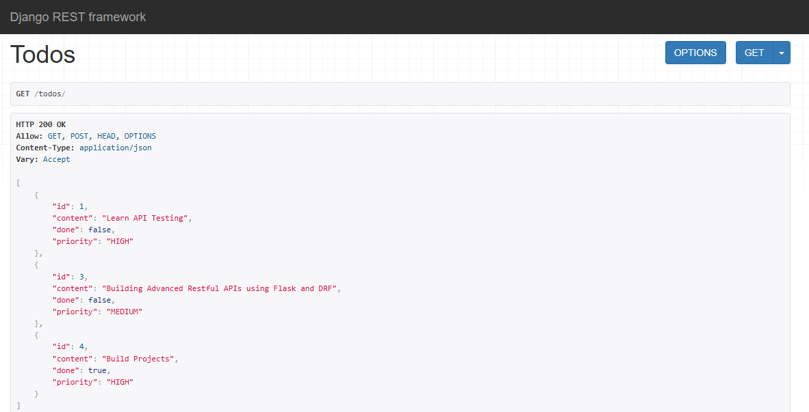
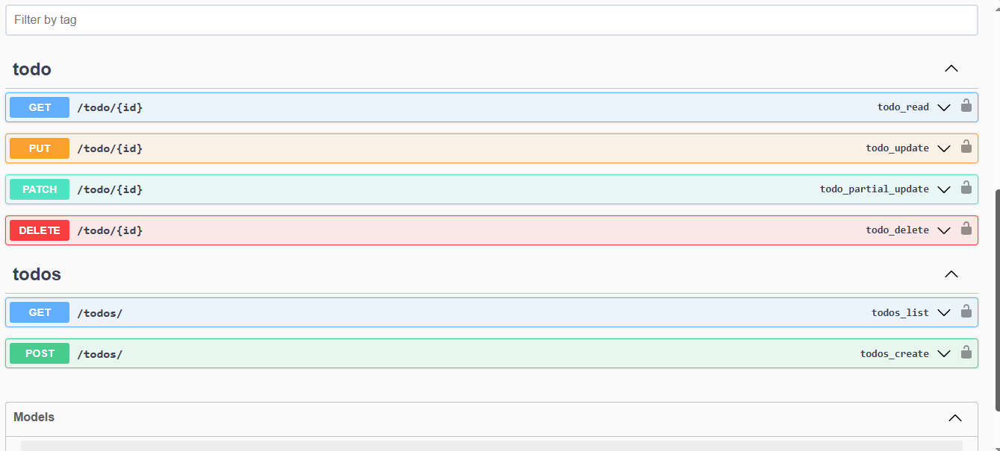
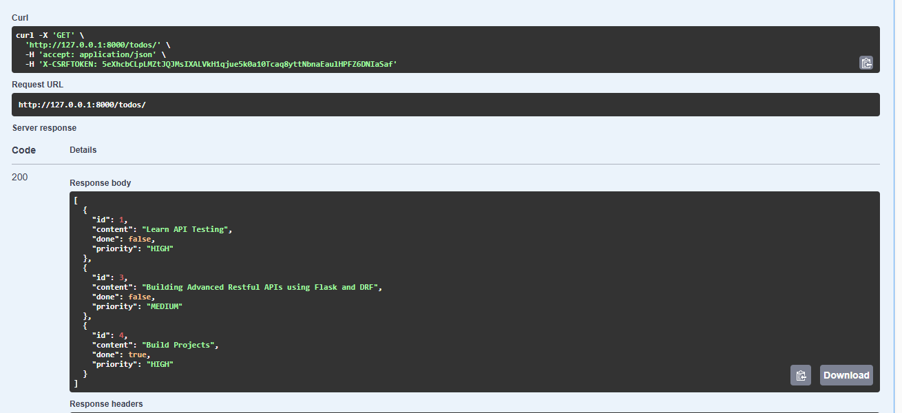

# TODO API

### This is a simple REST API built using DRF

## ENDPOINTS

| METHOD   | ROUTE         | FUNCTIONALITY        |
| -------- | ------------- | -------------------- |
| _GET_    | `/todos/`     | _Get all todos_      |
| _POST_   | `/todos/`     | _Create a todo_      |
| _GET_    | `/todo/{id}`  | _Get a todo by id_   |
| _PUT_    | `/todo/{id}/` | _Update a todo_      |
| _PATCH_  | `/todo/{id}/` | _Update todo status_ |
| _DELETE_ | `/todo/{id}/` | _Delete a todo_      |

### Output

